## ⚠️注意

- 部分图表使用中文会出错，渲染失败时使用英文查看是否正常。

- 网页console警告``render.ts:36 Do not assign mappings to elements without corresponding data (i.e. ele `app-cache` has no mapping for property `label` with data field `label`); try a `[label]` selector to limit scope to elements with `label` defined``请忽略，不影响显示。

## 流程图（Flowchart）

flowchart：

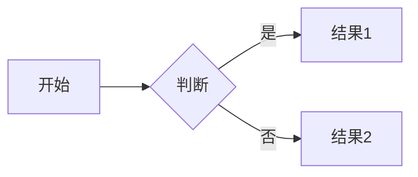

graph：


## 序列图（SequenceDiagram）

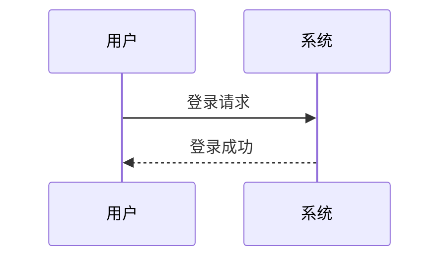

## 类图（ClassDiagram）

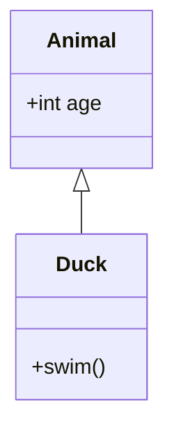

## 状态图（StateDiagram）

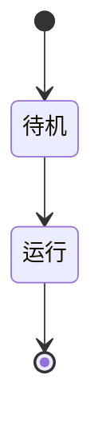

## 实体关系图（EntityRelationshipDiagram）

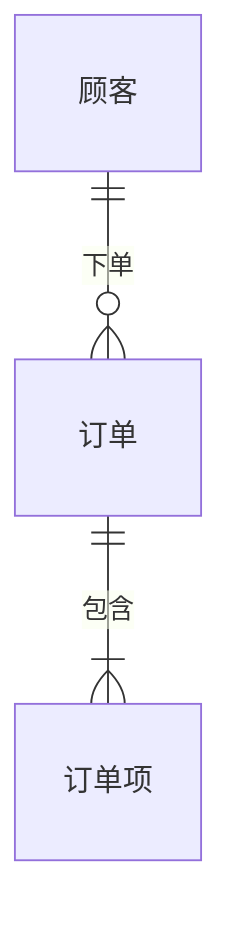

## 旅行图（JourneyChart）

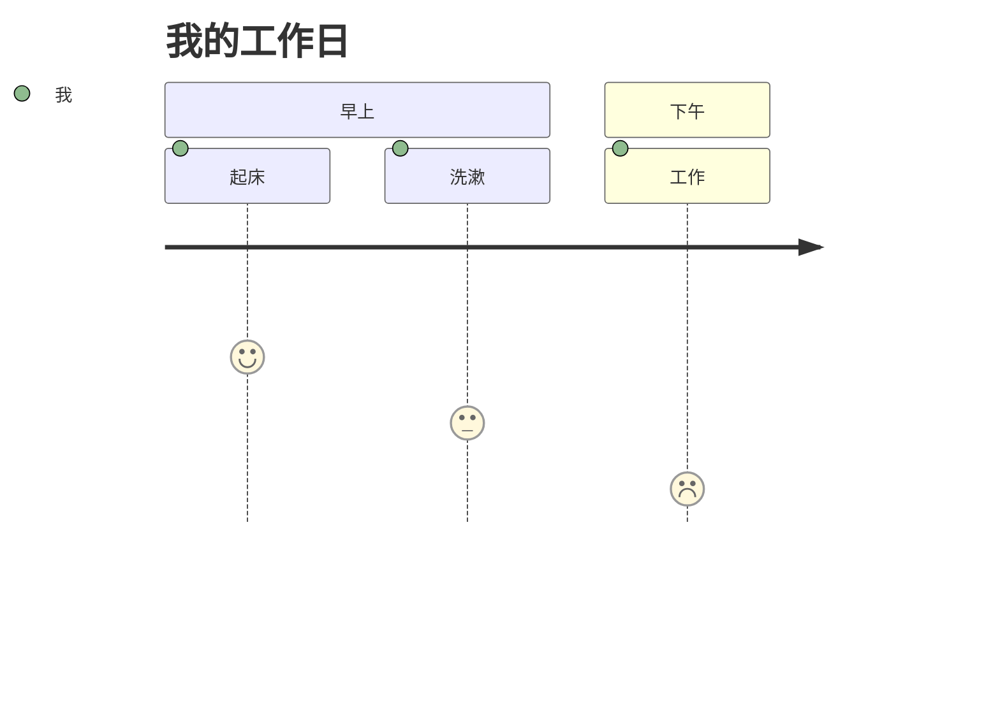

## 甘特图（GanttChart）

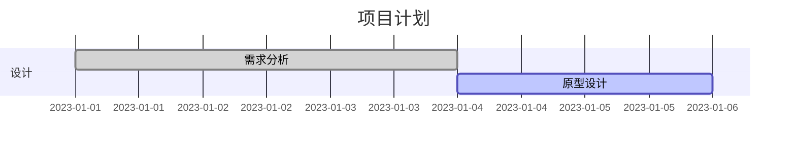

## 饼图（PieChart）

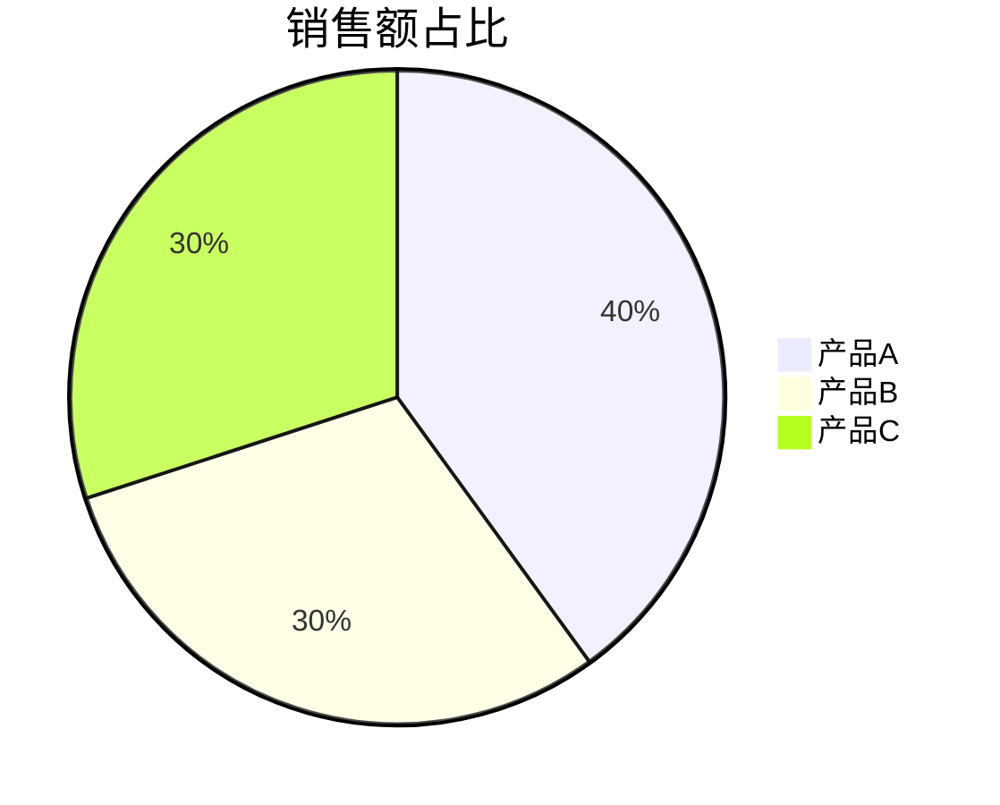

## 象限图（QuadrantChart）

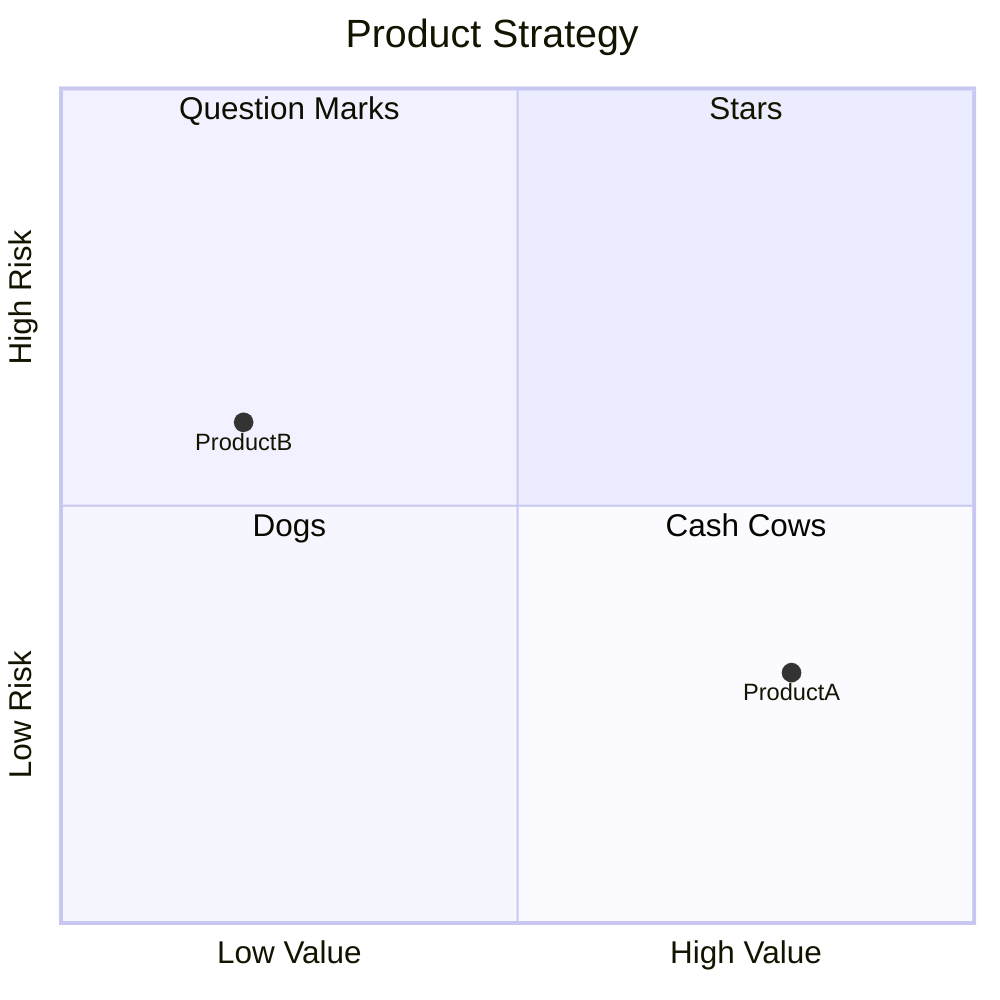

## 需求图（RequirementDiagram）

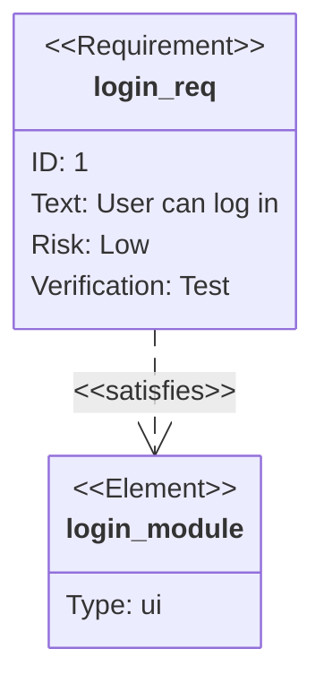

## 版本控制图（GitGraph）

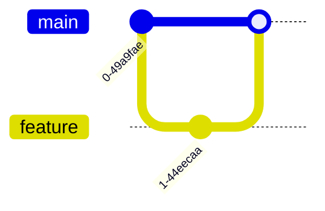

## C4图表（C4 Model）-暂不支持

暂不支持。

## 思维导图（Mindmap）


## 时间线（Timeline）

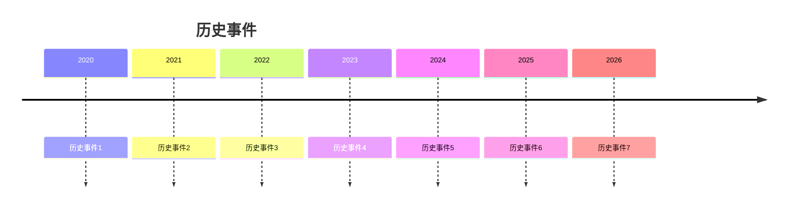

## 序列图（ZenUML）-暂不支持

暂不支持。

## 桑基图（Sankey）

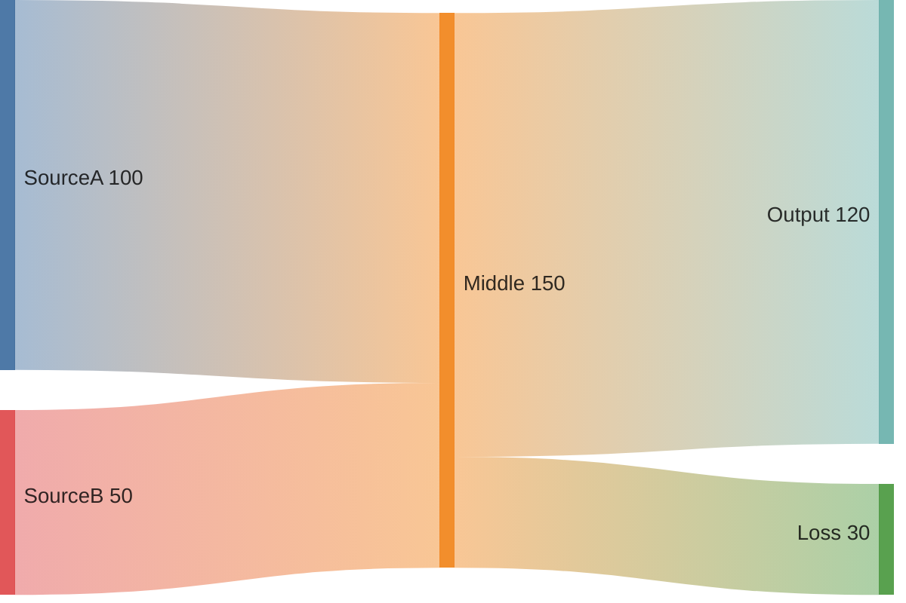

## XY 图表（XY Chart）

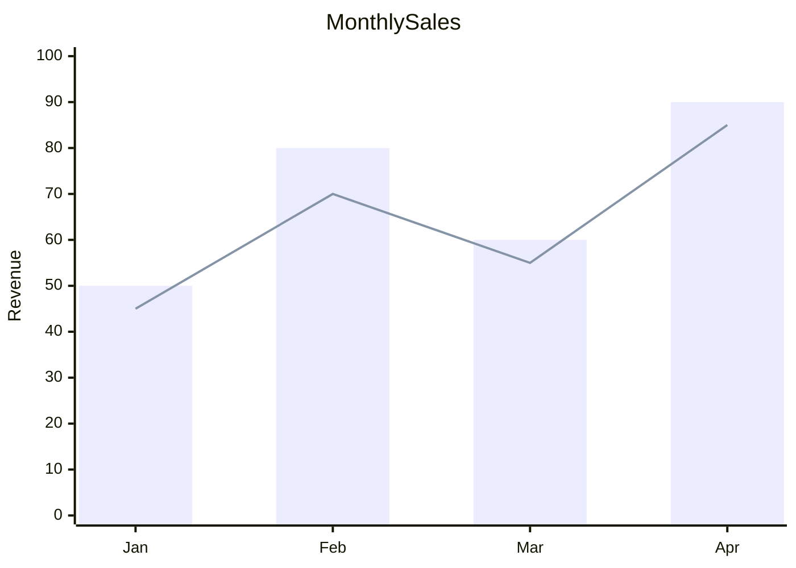

## 块图（Block）


## 数据包图（Packet）

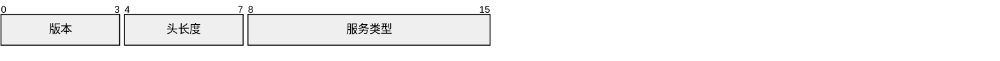

## 看板（Kanban）

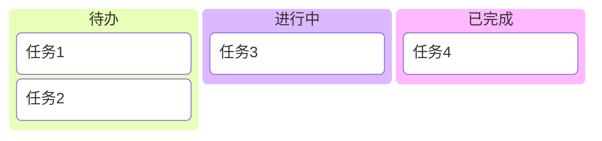

## 架构图（Architecture）

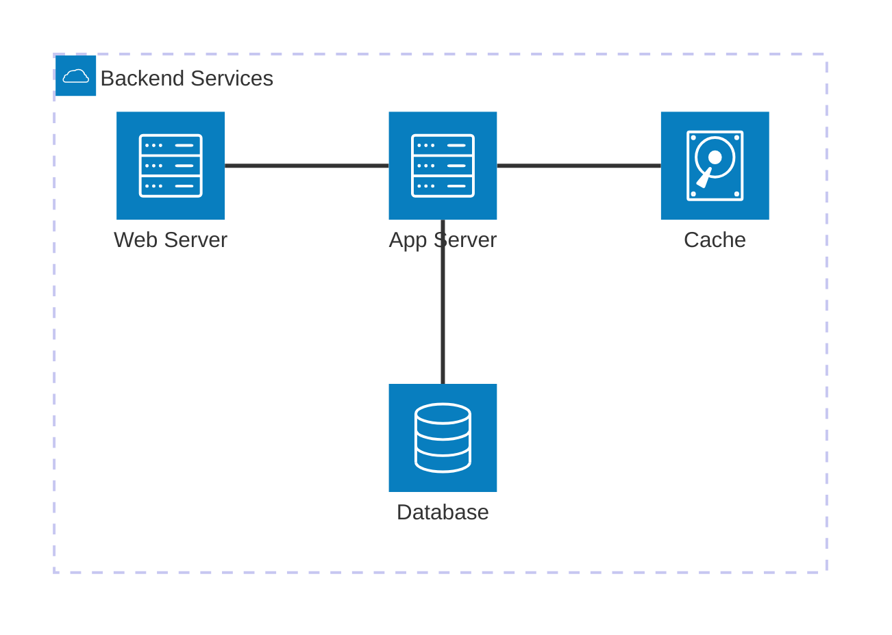

## 雷达图（Radar）

```mermaid
---
title: "学生成绩雷达图"
---
radar-beta
  axis m["语文"], s["数学"], e["英语"]
  axis h["历史"], g["地理"], a["政治"]
  curve a["小明"]{82, 91, 67, 74, 88, 95}
  curve b["小红"]{59, 76, 84, 93, 70, 68}
  curve c["小刚"]{47, 63, 89, 72, 81, 77}
  curve d["小方"]{95, 58, 82, 69, 73, 86}

  max 100
  min 0
```

## 树状图（Treemap）

```mermaid
treemap-beta
"分类1"
    "项1": 10
    "项2": 20
"分类2"
    "项3": 15
```